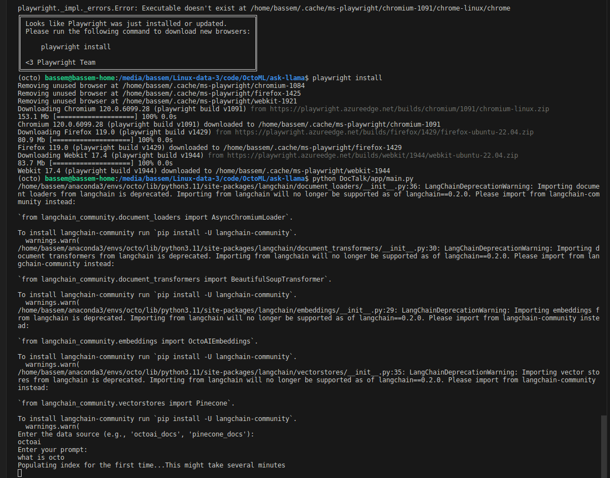

# README

## Project Overview

This project is a RAG Python application that leverages various libraries such as `pinecone`, `langchain`, and `beautifulsoup4` to create a Chat application with the documentation pages of two products; Pinecone and OctoAI. The application demonstrates how to do document processing, embedding generation, and conversational retrieval using the OctoAI LLM and Embeddings models and Pinecone as a Vector DB. It is designed to be run both as a command-line interface (CLI) application and as an AWS Lambda function.

## Features

-   Load and process documents from specified URLs.
-   Generate and use embeddings for text data.
-   Leverage the OctoAI LLM endpoints for language understanding and processing.
-   Compatible with AWS Lambda for serverless deployment.

## Prerequisites

Before running this application, you need to have Python installed on your system along with the application dependencies. You can install these packages using pip:

`pip install -r requirements.txt`

Additionally, you need to set up a `.env` file in the root of the project with the necessary environment variables.

-   To get an OctoAI API Token: please follow the steps here https://octo.ai/docs/getting-started/how-to-create-octoai-api-token
-   To get a Pinecone API Key: please follow the steps here https://docs.pinecone.io/docs/quickstart

### Playwright

The Langchain document loader we are using requires the playwright module. It needs to be initialized before first use. This can be done with the following command:

```bash
python3 -m playwright install
```

## Environment Variables

Make sure you have the `.env` file in the project's `app` directory, following this template:

```
PINECONE_API_KEY=YOUR-TOKEN
PINECONE_ENV=gcp-starter
OCTOAI_TOKEN=YOUR-TOKEN
OCTOAI_ENDPOINT_URL="https://text.octoai.run/v1/chat/completions"
OCTOAI_MODEL="llama-2-13b-chat-fp16"
```

Replace the placeholder values with your actual API keys and endpoints. Do remember to update the `PINECONE_ENV` variable if you are using an existing Pinecone environment.

## Running the Application

### As a Command-Line Interface

To run the application via CLI, execute the main script:

`python main.py`

You will be prompted to enter the data source and your query. After providing the necessary inputs, the application will process the request and display the output.

Note: The first time you run the application it will take several minutes to populate the pinecone index the first time. Subsequent runs should be very fast.



-   This code was tested on MacOS and Ubuntu

## As an AWS Lambda Function

The application can also be deployed as an AWS Lambda function. To do so, package the application with the required dependencies and upload it to AWS Lambda. Set the handler function as `main.handler`.

### Deploying the Application to AWS Lambda as a Container Image

#### Prerequisites:

-   AWS Account

-   AWS CLI configured

-   Docker installed

-   AWS SAM CLI installed (see https://docs.aws.amazon.com/serverless-application-model/latest/developerguide/install-sam-cli.html)

#### _Using AWS SAM CLI and Docker:_

To deploy this Python application to AWS Lambda using a container image,
you will need to follow these steps:

_Prepare the Dockerfile:_ Ensure the Dockerfile is set up correctly to
build a container image suitable for AWS Lambda. This involves
specifying the base image, copying your application code into the
container, installing any dependencies, and setting the entry point for
your Lambda function. We've provided you with a Dockerfile that meets
the requirements stated above so you can edit it.

_Build the Container Image:_ Use AWS SAM CLI to build your container
image. Run the following command from the `app/` directory:

`sam build --use-container`

#### _Deploy to AWS Lambda:_

First, you need to upload your container image to Amazon Elastic
Container Registry (ECR). You can do this using the Docker CLI.

The commands below assume your region is us-east-1, and you can modify it accordingly.


`aws ecr get-login-password --region us-east-1 | docker login --username AWS --password-stdin <YOUR_AWS_ACCOUNT_ID>.dkr.ecr.us-east-1.amazonaws.com`

`docker tag doctalkfunction:v1 <YOUR_AWS_ACCOUNT_ID>.dkr.ecr.us-east-1.amazonaws.com/doctalkfunction:v1`

`docker push <YOUR_AWS_ACCOUNT_ID>.dkr.ecr.us-east-1.amazonaws.com/doctalkfunction:v1`

Second, you need to create a lambda function of type container image from the uploaded docker image. You can do that from the AWS console by going to Lambda and then clicking Create new function as shown below


Configure Lambda and API Gateway: After deployment, you need to
configure your Lambda function in the AWS Management Console

####

####

#### _Increase the function timeout, and scale up the resource specs_

####

From the lambda function management console, go to General Configuration
and change the Timeout to 15 mins. Also since the compute resources are
allocated based on the Memory size you give to the lambda function, it
is a good idea to increase the Memory to 2048 MB


#### _Add configuration variables_


#### _Create API Gateway_

Use the python
script at `api-gateway.py` to create an API gateway for the lambda
function that allows clients to call it over HTTPS.

## Contributing

Contributions to this project are welcome. Please ensure that your code adheres to the project's coding standards and includes appropriate tests.

## License

This project is licensed under the MIT License.
