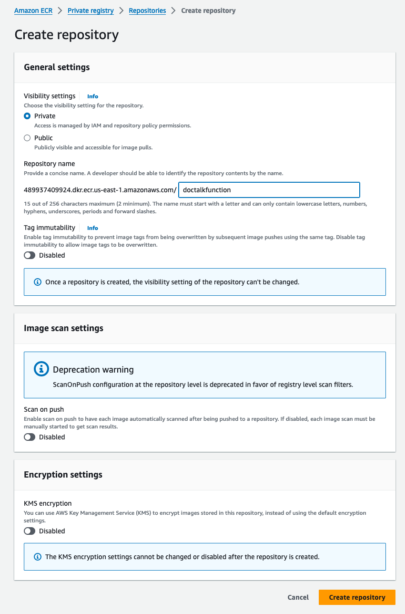
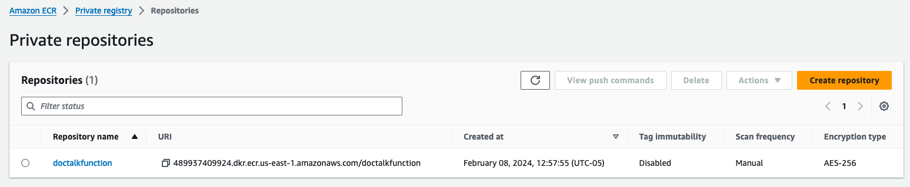
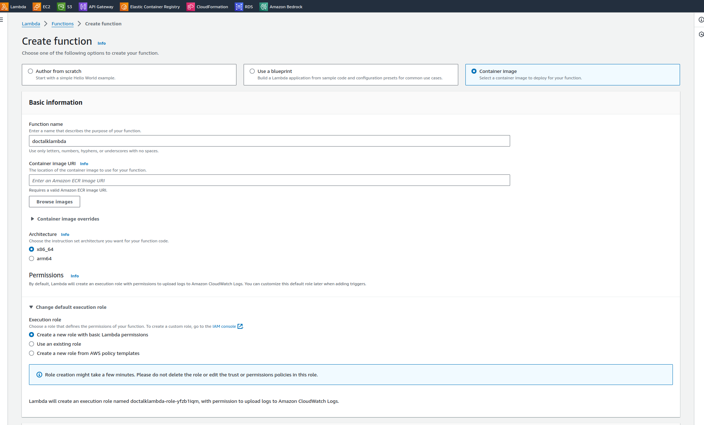
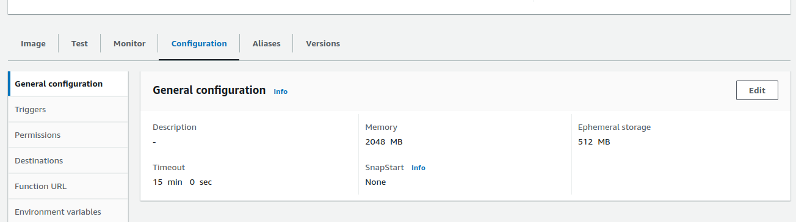
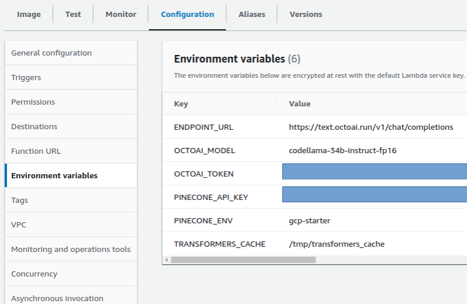

# How to build a full stack document Q&A chatbot using RAG powered by Langchain, OctoAI and Pinecone

## Project Overview

This "DocTalk" project presents a full stack RAG application that lets the user perform Q&A tasks on a documentation source of your choice. By default, we're performing documentation Q&A on the [Pinecone documentation pages](https://docs.pinecone.io/docs/quickstart).

Let's take a look at the layers that compose this full stack RAG application:
* We've built our RAG backend using Langchain in Python. The RAG example leverages Pinecone to provide a vector database, and OctoAI to provide an embedding (GTE-Large) and LLM (Mixtral-8x7B) API.
* This RAG Python backend containerized and deployed on an AWS Lambda which lets us easily connect any frontend to its serverless API.
* Finally we've built a Next.js front end which sents its request to the AWS Lambda to perform RAG on the documentation source. This Next.js frontend can be easily deployed on Vercel.

The application demonstrates how to do document processing, embedding generation, and conversational retrieval using the OctoAI LLM and Embeddings models and Pinecone as a Vector DB. It is designed to be run both as a command-line interface (CLI) application, as an AWS Lambda function, or as a Next.js user facing applications.


### This project is divided into 4 parts:

1. **Vector database setup**: you'll learn how to load and process documents from specified URLs, convert text data into embedding vector that will then be stored in a vector database hosted on Pinecone.
2. **Langchain Python app**: you'll run a standalone langchain app in Python that will let you perform simple RAG-based document question and answering against the vector database that you'll have set up in step 1.
3. **AWS Lambda setup**: you'll containerize the Langchain Python app using Docker and deploy it as an AWS Lambda serverless function.
4. **Frontend testing and deployment**: you'll run and deploy a Next.js frontend for your app on Vercel to allow anyone to perform documentation Q&A on a streamlined webapp.


## Features

### Back-end
- Load and process documents from specified URLs.
- Generate embeddings for text data using OctoAI embedding API.
- Populate your embedding vectors into a Pinecone vector database.
- Leverage the OctoAI LLM endpoints for language understanding and processing (specifically OctoAI).
- Compatible with AWS Lambda for serverless deployment.

### Front-end
- Utilize the AWS Lambda option from the Python backend.
- Pre-built Next.js starter to get started, quick.
- Tailwind, for easy plug and play with your own theme.

## Prerequisites

### API Tokens

For this RAG example, you'll be using Pinecone for the vector database:
-   To get a Pinecone API Key: please follow the steps [here](https://docs.pinecone.io/docs/quickstart)

You'll also be using OctoAI for the embedding model and LLM APIs:
-   To get an OctoAI API Token: please follow the steps [here](https://octo.ai/docs/getting-started/how-to-create-octoai-api-token)

### Python Setup

Before running this application, you need to have Python installed on your system along with the application dependencies. You can use tools like `conda`, `poetry`, or `virtual env` to manage your Python environments.

If you're using virtual env, you can run the following from this top level directory:

```bash
python3 -m venv .venv
source .venv/bin/activate
```

Then you can install these packages using pip:

```bash
python3 -m pip install -r requirements.txt
```

#### Playwright

The Langchain document loader you'll be using requires the playwright module. It needs to be initialized before first use. This can be done with the following command:

```bash
python3 -m playwright install
```

#### AWS Lambda

You'll need:

* Docker installed [link](https://docs.docker.com/engine/install/)
* AWS Account [link](https://portal.aws.amazon.com/gp/aws/developer/registration/index.html)
* AWS CLI installed and configured [link](https://aws.amazon.com/cli/)
* AWS SAM (Serverless Application Model) CLI installed [link](https://docs.aws.amazon.com/serverless-application-model/latest/developerguide/install-sam-cli.html)

Finally you'll need to pip install `boto3` to run the `api-gateway.py` script, with:

```bash
python3 -m pip install boto3
```

### Next.js

Before running this application, you need to make sure you are set up to run Next.js. Learn more in the [Next.js docs](https://nextjs.org/docs/getting-started/installation).

## 1 - Vector DB Setup

In this section, you'll learn how to load and process documents from specified URLs, convert text data into embedding vector that will then be stored in a vector database hosted on Pinecone.

### Environment Setup

Make sure you have the `.env` file in the project's `vector_db/` directory, following this template:

```
PINECONE_API_KEY=YOUR-PINECONE-TOKEN
PINECONE_ENV=gcp-starter
OCTOAI_TOKEN=YOUR-OCTOAI-TOKEN
```

It's highly likely you'll be getting started in Pinecone's `gcp-starter` pod environment if you're using the free tier of their service. See what other pod environments are available on [their documentation page](https://docs.pinecone.io/docs/indexes#pod-environments).

Replace the placeholder values with your actual API keys and endpoints, which you can obtain by following the pre-requisite steps above.

### Setting up the Vector DB

To set up the Pinecone Vector DB, go ahead and run the following script in `vector_db`:

`python3 init_vectordb.py`

It will take several minutes to scrape the documents, perform pre-processing of the text information, convert to the vector space, and populate the pinecone index.

You should see an output that looks as follows after executing the script. You can ignore the Beautiful Soup warning.

```
Initializing the Pinecone index...
Loading the content we want to run RAG on, this could take a couple of minutes...
/Users/moreau/Documents/Projects/octoai-textgen-cookbook/doctalk/vector_db/init_vectordb.py:46: MarkupResemblesLocatorWarning: The input looks more like a filename than markup. You may want to open this file and pass the filehandle into Beautiful Soup.
  return {"page_content": str(BeautifulSoup(content, "html.parser").contents)}
Preprocessing the data before storing in the vector DB
Adding the vector embeddings into the database, this could take a couple of minutes...
Done!
```

This code was tested on MacOS and Ubuntu.

## 2 - RAG Langchain App

In this section, you'll run a standalone langchain app in Python that will let you perform simple RAG-based document question and answering against the vector database that you'll have set up in part 1.

### Environment Setup

Make sure you have the `.env` file in the project's `langchain` directory, following this template:

```
PINECONE_API_KEY=YOUR-TOKEN
PINECONE_ENV=gcp-starter
OCTOAI_TOKEN=YOUR-TOKEN
OCTOAI_ENDPOINT_URL="https://text.octoai.run/v1/chat/completions"
OCTOAI_MODEL="llama-2-13b-chat-fp16"
```

Replace the placeholder values with your actual API keys and endpoints. Do remember to update the `PINECONE_ENV` variable if you are using an existing Pinecone environment.

## Running the Application

### As a Command-Line Interface

To run the application via CLI, execute the main script:

`python3 main.py`

You will be prompted to enter a prompt against the Pinecone data source. For instance one can ask: `how to I populate a Pinecone database with embeddings in Python`. The response will look as follow:

```text
    Enter your prompt:
    how to I populate a Pinecone database with embeddings in Python
    Response: #OctoAI LLM#
    To populate a Pinecone database with embeddings in Python, follow these steps:

    1. Install the Pinecone library: First, make sure you have installed the Pinecone library for Python. You can install it using pip:
    ```
    pip install pinecone-client
    ```

    2. Set up your Pinecone API key and initialize the Pinecone client:
    ```python
    import pinecone

    pinecone.deinit()  # Make sure to deinitialize the client if it was initialized already
    api_key = 'YOUR_API_KEY'
    pinecone.init(api_key=api_key)
    ```

    3. Create an index: Before uploading any data, you need to create an index with the desired dimension and distance metric. For instance, create an index called `example-index` with a dimension size of 1536 and dot product metric:
    ```python
    index_name = "example-index"
    dimension = 1536
    metric = "dotproduct"

    serverless_spec = pinecone.ServerlessSpec(cloud='aws', region='us-west-2')
    pinecone.create_index(index_name=index_name, dimension=dimension, metric=metric, spec=serverless_spec)
    ```

    4. Upsert vector embeddings: After creating the index, you can upsert vector embeddings and associated metadata with the Pinecone API. For example, given two vectors with their respective metadata, you can upsert them like this:

    ```python
    vectors = [
        {
            "id": "vec1",
            "values": [0.1, 0.2, 0.3],
            "metadata": {"genre": "drama"},
            "sparse_values": {
                "indices": [10, 45, 16],
                "values": [0.5, 0.5, 0.2],
            },
        },
        {
            "id": "vec2",
            "values": [0.2, 0.3, 0.4],
            "metadata": {"genre": "action"},
            "sparse_values": {
                "indices": [15, 40, 11],
                "values": [0.4, 0.5, 0.2],
            },
        },
    ]

    namespace = "example-namespace"
    index = pinecone.Index(index_name=index_name)
    upsert_response = index.upsert(vectors=vectors, namespace=namespace)
    ```

    Now you have successfully populated a Pinecone database with embeddings using Python. Once data is upserted, you can proceed to query the index. To learn more about querying the index with Python, refer to the official Pinecone Python documentation: <https://pinecone.io/start/>.
```

This code was tested on MacOS and Ubuntu

## 3 - AWS Lambda Setup

In this section, you'll containerize the Langchain Python app using Docker and deploy it as an AWS Lambda function.

To do so, you'll containerize the application with the required dependencies and upload it to AWS ECR. The containerized will then be deployed as an AWS Lambda.

### Using AWS SAM CLI and Docker to containerize the application

We've already provided the following files for you to deploy the RAG Python application to AWS Lambda.

* `Dockerfile`: used to build a container image suitable for AWS Lambda. The file contents are used to specify the base image, copying your application code into the container, installing any dependencies, and setting the entry point for
your Lambda function. You can use the Dockerfile as is or extend it to suit your needs.
* `template.yaml`: AWS SAM specification to define your serverless application.


To deploy this Python application to AWS Lambda using a container image, you will need to follow these steps:


_Copy the files over to build the Docker image:_ You'll need to copy the following files into the `aws_lambda/` directory to build the Docker container image with AWS SAM. Run the commands below under the `aws_lambda/` directory.

```bash
cp ../requirements.txt .
cp ../langchain_app/main.py .
```

_Build the container image:_ Use AWS SAM CLI to build your container image. Run the following command from the `aws_lambda/` directory:

```bash
sam build --use-container
```

The image should build successfully with the following text at the end of the build:
```
Successfully built b21516aa0a4d
Successfully tagged doctalkfunction:v1


Build Succeeded

Built Artifacts  : .aws-sam/build
Built Template   : .aws-sam/build/template.yaml

Commands you can use next
=========================
[*] Validate SAM template: sam validate
[*] Invoke Function: sam local invoke
[*] Test Function in the Cloud: sam sync --stack-name {{stack-name}} --watch
[*] Deploy: sam deploy --guided
```

Check that indeed the Docker image has been built successfully with the following command:
```bash
docker image ls
```

### Upload docker image to AWS ECR

Once the image is built, you'll need to upload your container image to Amazon Elastic Container Registry (ECR).

Log into your AWS console, and search for Amazon Elastic Container Registry in the search bar in order to access the ECR management page.

Now click on "Create repository":
* Leave visibility settings to `Private`.
* Note the path to the repository name. It should start as follows: `accountid.dkr.ecr.region.amazonaws.com/`. We'll name our registry `doctalkfunction`.
* Leave all other options to their default and create the repository by clicking on `Create repository`.



Now that the private repository has been created, note its URI that will look as follows: `accountid.dkr.ecr.region.amazonaws.com/doctalkfunction`. We'll refer to it as `YOUR-ECR-URI`.



We'll use the following commands to upload the container image we've just built to the ECR repository.

```bash
aws ecr get-login-password --region us-east-1 | docker login --username AWS --password-stdin <YOUR-ECR-URI>
docker tag doctalkfunction:v1 <YOUR-ECR-URI>:v1
docker push <YOUR-ECR-URI>:v1
```

### Deploy to AWS Lambda

Next, you'll create a lambda function of type "Container Image" from the docker image you'll have just uploaded to ECR.

You can do that from your AWS console by going to Lambda and then clicking "Create function" as shown below.



Once the new Lambda function has been created, you can configure the Lambda by clicking on its name under the "Functions" listed on your AWS Lambda management page, which you can access from the AWS console.

Note the Function ARN, which you'll need when setting up the API gateway.

#### Configure Lambda

From the Lambda Function management console, go to Configuration -> General Configuration -> Edit. Change the Timeout to 15 mins (its maximum). Also since the compute resources are allocated based on the Memory size you give to the lambda function, it is a good idea to increase the Memory to 2048 MB



#### Set environment variables

Set the environment variables under Configuration -> Environment Variables to reflect the variables you've set under the `langchain_app/.env` file.



#### Create API Gateway

We'll run the `api-gateway.py` to create an API gateway.

Before running the script, replace `MyLambdaARN` in the snippet below with the function ARN from the Lambda Function management console.

```python
LAMBDA_ARN = "MyLambdaARN"
```

It should follow the following format: `arn:aws:lambda:<region>:<accountid>:function:doctalklambda`

Now that `LAMBDA_ARN` has been set, run the python script at `api-gateway.py` to create an API gateway for the lambda function that allows clients to call it over HTTPS.

You'll get the following output if the script executes correctly:
```
API Gateway URL: ...
API Key for client authentication: ...
```

Your Lambda is ready! Note the two entries above as you'll need them in the frontend setup stage.

## 4 - Frontend Setup

In this section, you'll run and deploy a Next.js frontend for your app on Vercel to allow anyone to perform documentation Q&A on a streamlined webapp.


### Environment Setup

Make sure you have the `.env` file under `frontend/`, following this template:

```
API_ENDPOINT=YOUR-ENDPOINT
API_KEY=YOUR-KEY
```

These environment variable values are obtained from the last step in Stage 3 (API gateway setup).

### Developing

Install dependencies

```bash
yarn
```

Start the dev server

```bash
yarn dev
```

## Deploying

The easiest way to deploy is by using [Vercel](https://vercel.com/docs/frameworks/nextjs), but you can use [any host](https://nextjs.org/docs/app/building-your-application/deploying#self-hosting) that supports Node.js.

## Contributing

Contributions to this project are welcome. Please ensure that your code adheres to the project's coding standards and includes appropriate tests.

## License

This project is licensed under the MIT License.
