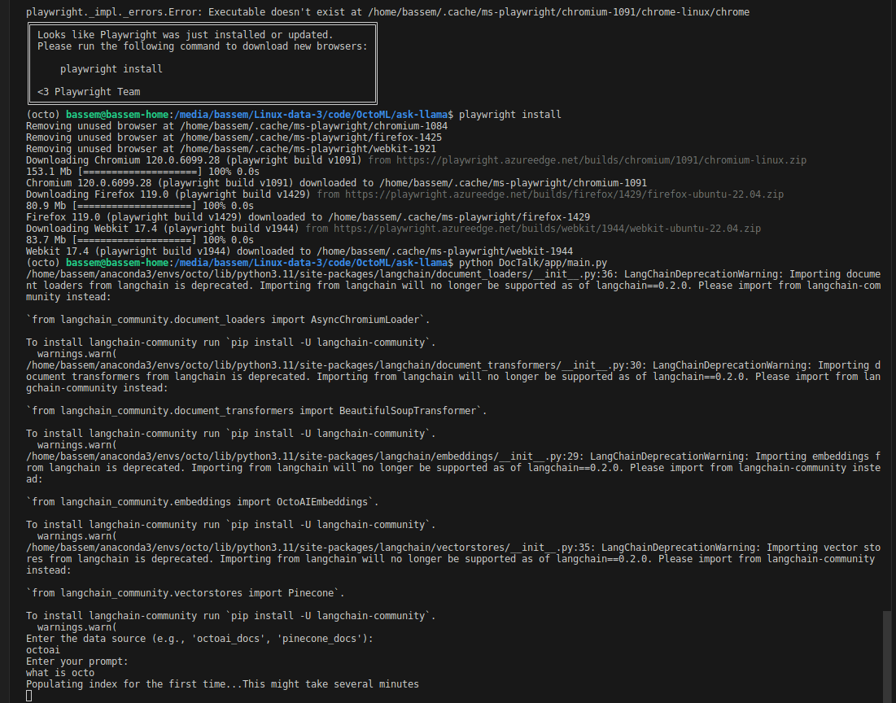
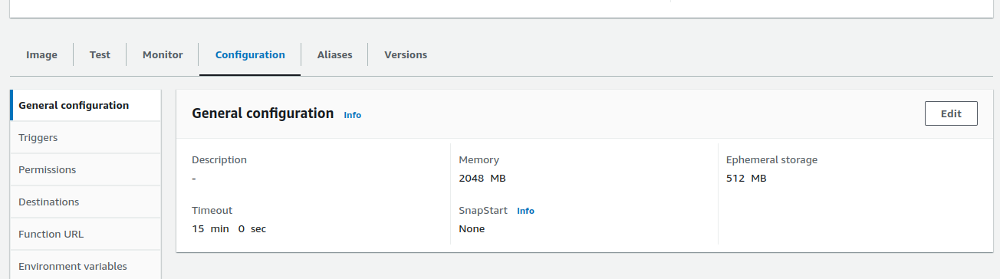
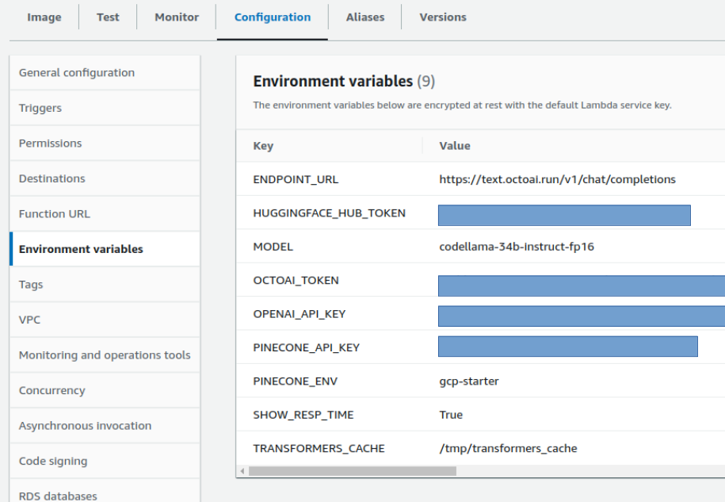

README
======

Project Overview
----------------

This project is a RAG Python application that leverages various libraries such as `pinecone`, `langchain`, and `beautifulsoup4` to create a Chat application with the documentation pages of two products; Pinecone and OctoAI. The application demonstrates how to do  document processing, embedding generation, and conversational retrieval using the OctoAI LLM and Embeddings models and Pinecone as a Vector DB. It is designed to be run both as a command-line interface (CLI) application and as an AWS Lambda function.

Features
--------

*   Load and process documents from specified URLs.
*   Generate and use embeddings for text data.
*   Leverage the OctoAI LLM endpoints for language understanding and processing.
*   Compatible with AWS Lambda for serverless deployment.

Prerequisites
-------------

Before running this application, you need to have Python installed on your system along with the application dependencies. You can install these packages using pip:

`pip install -r requirements.txt`

Additionally, you need to set up a `.env` file in the root of the project with the necessary environment variables.

* To get an OctoAI API Token: please follow the steps here https://docs.octoai.cloud/docs/how-to-create-an-octoai-access-token
* To get a Pinecone API Key: please follow the steps here https://docs.pinecone.io/docs/quickstart

Environment Variables
---------------------

Make sure you have the `.env` file in the project root directory and add the blank environment variables values to it such as:

`PINECONE_API_KEY=your_pinecone_api_key`

`OCTOAI_TOKEN=your_octoai_token`

Replace the placeholder values with your actual API keys and endpoints.

Running the Application
-----------------------

### As a Command-Line Interface

To run the application via CLI, execute the main script:

`python main.py`

You will be prompted to enter the data source and your query. After providing the necessary inputs, the application will process the request and display the output.

Note: The first time you run the application, you will hit a couple of small issues shown below. You need to run the command to install playwright separately, then run the application again. It will now take several minutes to populate the pinecone index the first time. Subsequent runs should be very fast.

* This code was tested on MacOS and Ubuntu

## As an AWS Lambda Function

The application can also be deployed as an AWS Lambda function. To do so, package the application with the required dependencies and upload it to AWS Lambda. Set the handler function as `main.handler`.

### Deploying the Application to AWS Lambda as a Container Image

####  Prerequisites:

-   AWS Account

-   AWS CLI configured

-   Docker installed

-   AWS SAM CLI installed (see https://docs.aws.amazon.com/serverless-application-model/latest/developerguide/install-sam-cli.html)

#### *Using AWS SAM CLI and Docker:*

To deploy this Python application to AWS Lambda using a container image,
you will need to follow these steps:

*Prepare the Dockerfile:* Ensure the Dockerfile is set up correctly to
build a container image suitable for AWS Lambda. This involves
specifying the base image, copying your application code into the
container, installing any dependencies, and setting the entry point for
your Lambda function.

*Build the Container Image:* Use AWS SAM CLI to build your container
image. The command would generally be:

`sam build --use-container`

Test Locally (Optional): Before deploying, you can test your Lambda
function locally using SAM

`sam local invoke`

#### *Deploy to AWS Lambda:*

First, you need to upload your container image to Amazon Elastic
Container Registry (ECR). You can do this using the Docker CLI.

Then, use AWS SAM CLI to deploy your application. This involves
packaging your application and deploying it using a SAM template:

`sam package --output-template-file packaged.yaml --s3-bucket`

`sam deploy --template-file packaged.yaml --stack-name --capabilities
CAPABILITY_IAM`

Configure Lambda and API Gateway: After deployment, you need to
configure your Lambda function in the AWS Management Console

#### 

#### 

#### *Increase the function timeout, and scale up the resource specs*

####  

From the lambda function management console, go to General Configuration
and change the Timeout to 15 mins. Also since the compute resources are
allocated based on the Memory size you give to the lambda function, it
is a good idea to increase the Memory to 2048 MB

#### *Add configuration variables*

#### *Create API Gateway*

Follow the steps described in this article below or use the python
script at `api-gateway.py` to create an API gateway for the lambda
function that allows clients to call it over HTTPS
https://docs.aws.amazon.com/apigateway/latest/developerguide/api-gateway-create-api-as-simple-proxy-for-lambda.html#api-gateway-create-api-as-simple-proxy-for-lambda-build

Contributing
------------

Contributions to this project are welcome. Please ensure that your code adheres to the project's coding standards and includes appropriate tests.

License
-------

This project is licensed under the MIT License.
